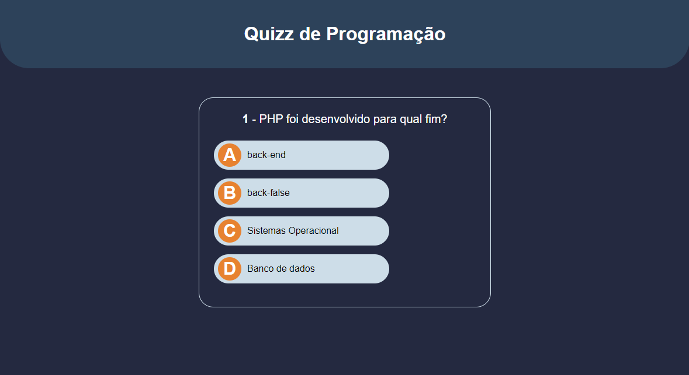
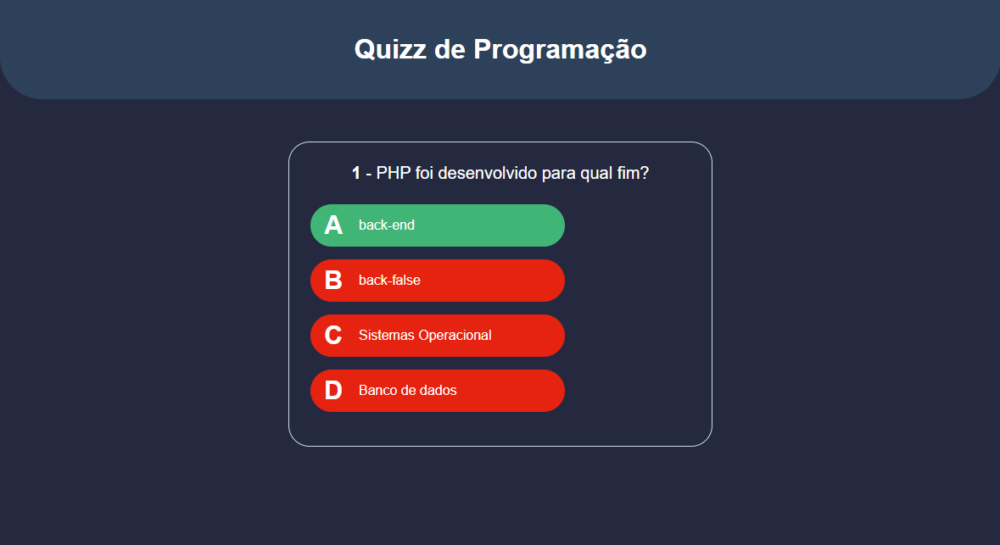
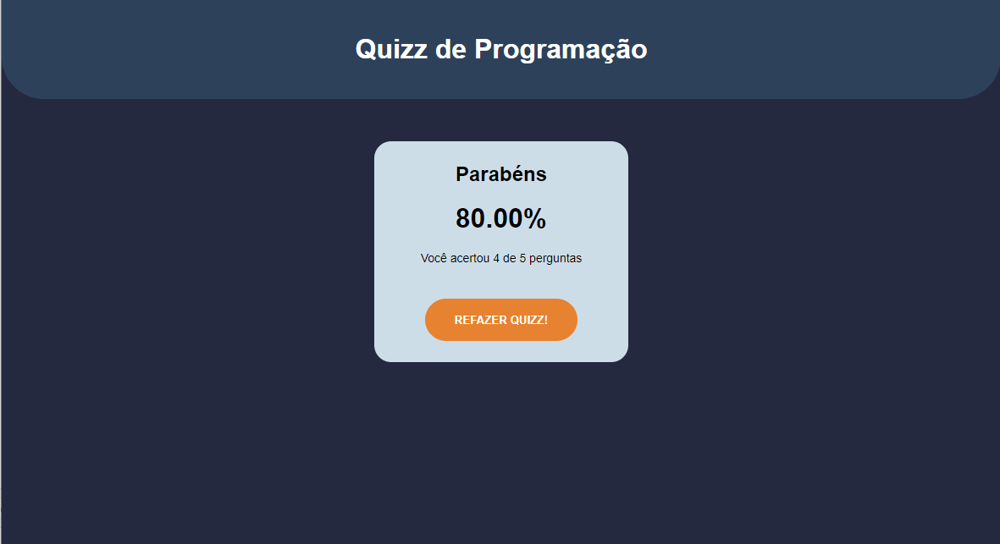

# Projeto Quizz

Projeto Quizz de programadores. Utilizando JavaScript, CSS e HTML.

Realizar o clone do projeto e clicar em index.html

# Screenshot

Selecionar uma alternativa.

Retorno da alternativa selecionada.

Finalização do Quizz. Caso queira retornar na tela inicial, basta clicar em "Refazer Quiz"

